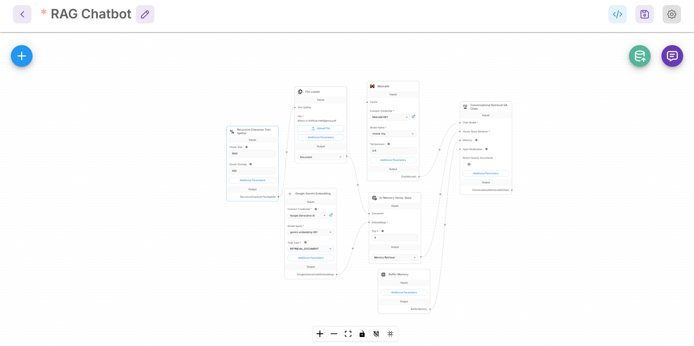
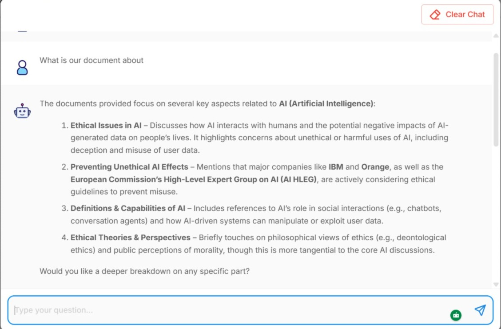
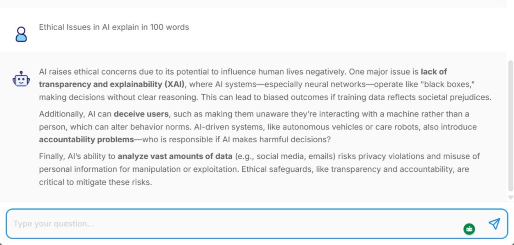
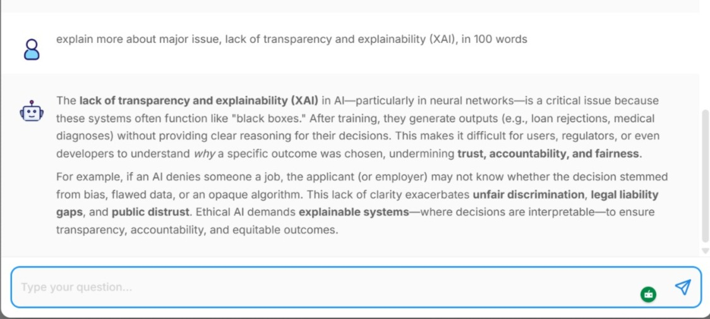

# AI Ethics RAG Chatbot 🤖

## Project Overview
This project is an AI-powered Retrieval-Augmented Generation (RAG) chatbot built using Flowise. It is designed to answer questions based on documents related to Artificial Intelligence Ethics.

The chatbot retrieves relevant information from documents and generates accurate, context-based responses.

---

## Objective
- To apply AI in real-world problem solving
- To improve document-based question answering
- To ensure ethical and responsible AI responses

---

## Tech Stack
- Flowise AI
- Mistral AI (LLM)
- Google Gemini Embeddings
- Vector Store (In-Memory)
- Conversational Retrieval QA Chain

---

## Workflow Explanation

1. **File Loader**
   - Loads the AI ethics document

2. **Text Splitter**
   - Splits document into smaller chunks for processing

3. **Embeddings**
   - Converts text into vector format using Gemini

4. **Vector Store**
   - Stores embeddings for similarity search

5. **Retriever**
   - Fetches relevant content based on user query

6. **Chat Model (Mistral)**
   - Generates responses using retrieved context

7. **Conversational Chain**
   - Maintains chat history for better interaction

---

## Key Features
- Context-aware responses
- Ethical AI-focused knowledge
- Conversational memory
- Prevents hallucination (answers only from documents)

---

## Screenshots

### 🔹 Flowise Workflow

### 🔹 Chatbot Interaction

---

---

## Project Files
- Chatflow JSON (Flowise)
- AI Ethics document
- Screenshots

---

## How to Run

1. Open Flowise
2. Import the JSON file from `/chatflow`
3. Add API keys:
   - Mistral API
   - Google Gemini API
4. Upload document
5. Run chatbot

---

## Future Improvements
- Add database (Pinecone / FAISS)
- Deploy chatbot on web
- Add multi-document support

---

## Author
Sukhpreet Kaur

---

## License
This project is for educational purposes.
